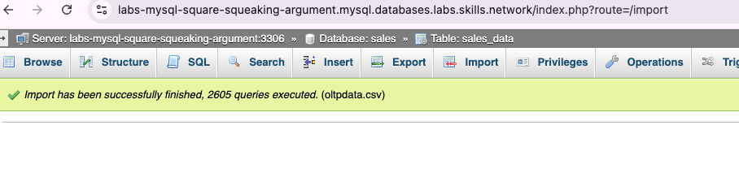
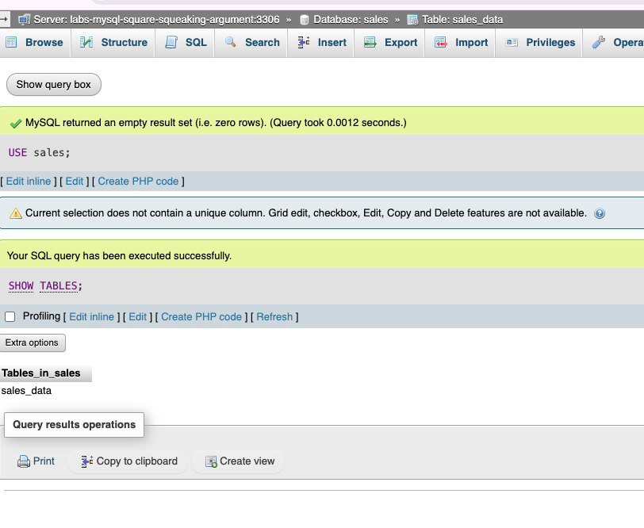
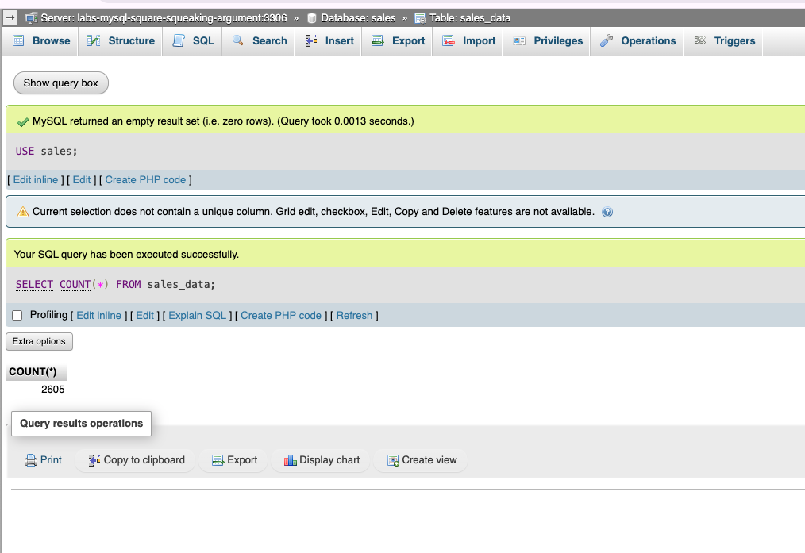
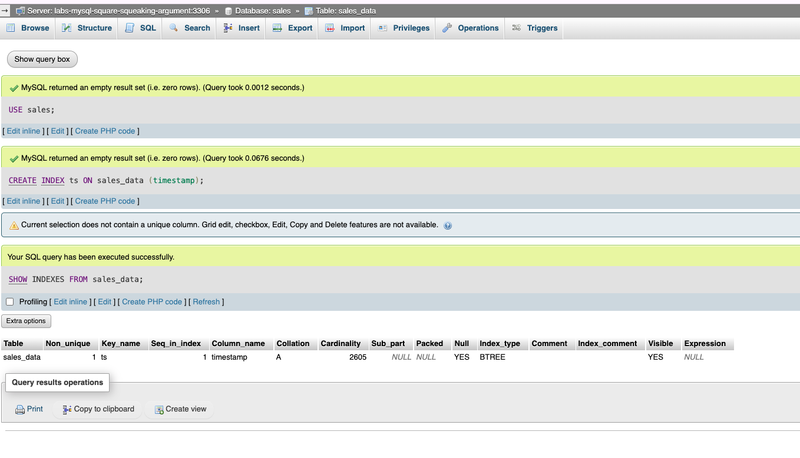
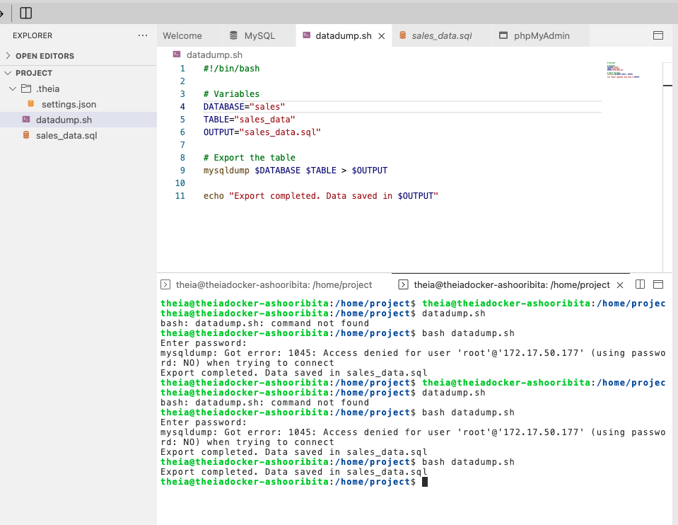

# 🛒 OLTP Database for E-Commerce Platform

This project simulates an **e-commerce company's** Online Transaction Processing (OLTP) data platform using **MySQL**. It includes schema design, data import, and automation of admin tasks using `mysqldump` and bash scripting.

---

## 📌 Scenario

An e-commerce company needs to manage customer orders, product details, and transactions efficiently. As a database engineer, your job is to:

- Design an OLTP relational schema
- Populate it with real transaction-like data
- Automate administrative tasks like data exports and index creation

---

## 🎯 Objectives

1. **Design the schema** for an OLTP MySQL database.
2. **Load data** from CSV files into the database using phpMyAdmin.
3. **Automate admin tasks** such as indexing, data export, and table listing using SQL and Bash scripting.

---

## 🛠️ Tools & Technologies

| Tool          | Version |
|---------------|---------|
| MySQL         | 8.0.22  |
| phpMyAdmin    | 5.0.4   |
| Bash / Terminal | Any   |

---

## 🗃️ Database Structure

**Database Name:** `sales`

**Primary Table:** `sales_data`

| Column Name  | Data Type     | Description                         |
|--------------|---------------|-------------------------------------|
| product_id   | INT           | ID of the product                   |
| customer_id  | INT           | ID of the customer                  |
| price        | DECIMAL(10,2) | Price of the product                |
| quantity     | INT           | Quantity purchased                  |
| timestamp    | DATETIME      | Time of transaction                 |

- Composite Unique Constraint: (`product_id`, `customer_id`)
- Index: `timestamp` field indexed as `ts`

---

## 📥 Data Import

- File: `oltpdata.csv`
- Tool: **phpMyAdmin > Import**
- Table: `sales_data`

---

## 🛠️ Setup Instructions

Follow the steps below to create the database, design the schema, load data, run SQL queries, and automate exports using a Bash script.

---

### 📁 Step 1: Create the Database and Table

```sql
-- Create the database
CREATE DATABASE sales;
USE sales;

-- Design the sales_data table
CREATE TABLE sales_data (
    product_id INT,
    customer_id INT,
    price DECIMAL(10,2),
    quantity INT,
    timestamp DATETIME
);
```
## 📥 Load the Data

Import the oltpdata.csv file into the sales_data table using the Import tab in phpMyAdmin.

```sql
USE sales;
SHOW TABLES;
SELECT COUNT(*) FROM sales_data;
```

## ⚙️ Admin Automation Tasks

### ✅ Create an Index

```sql
CREATE INDEX ts ON sales_data (timestamp);
SHOW INDEXES FROM sales_data;
```

## ⚙️ Bash Automation Script

```sql
#!/bin/bash
# File: datadump.sh

USER="root"
PASSWORD="your_password"
DATABASE="sales"
TABLE="sales_data"
OUTPUT="sales_data.sql"

mysqldump -u $USER -p$PASSWORD $DATABASE $TABLE > $OUTPUT
echo "Export completed. File saved as $OUTPUT"
```

Make sure to give the script executable permissions using:
chmod +x datadump.sh


## 🖼️ Screenshots

### 📌 Import Status


### 📌 List of Tables


### 📌 Record Count


### 📌 Indexes in Table


### 📌 Export via Bash

